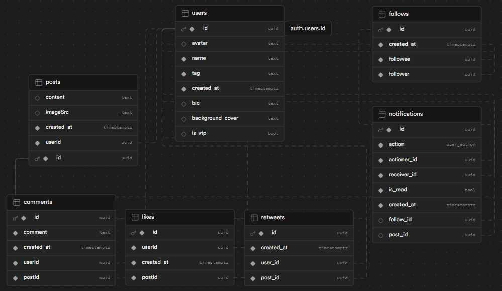

# Webber

Webber is a social app inspired by Twitter, built with Vue 3 Composition API written in TypeScript, styled with Tailwind CSS, and uses Supabase as BaaS to handle authentication and database management.

<a style='font-size:large;font-weight:700;' href="https://webber-nine.vercel.app/">Live Demo</a>

## Features

- Users can post articles and upload up to 4 images per post.
- Typography for YouTube iframes, mentions, tags, and hyperlinks.
- Users can like and retweet posts.
- Users can follow/unfollow other users.
- Toggle tweets feed between recommendations and follow-only.
- Supports drag-and-drop & clipboard images uploading.
- Preview images in buffer before uploading.
- Notification system.
- Search post content using PG textsearch.
- Show Trending Keywords using PG textsearch.
- RWD supporting devices from mobile to 4K desktop monitor.
- Update views after HTTP requests and auto refetch using Vue Query.

## Diagram


## Database Schema



## Tech Stack

- **[Vue.js](https://vuejs.org/)**: Frontend client-side rendering using Composition API.
- **[Tailwind CSS](https://tailwindcss.com)**: Styling, RWD.
- **[Supabase](https://supabase.com/)**: BaaS handling auth, S3 upload and PostgreSQL.
- **[Pinia](https://pinia.vuejs.org/)**: User metadata state management.
- **[TanStack Query](https://tanstack.com/query)**: Caching and revalidating HTTP requests.

## Local Setup

### 1. Make sure Bun is installed then run

```
bun install
```

### 2. Create Supabase project

Create your Supabase project at [Supabase Dashboard](https://supabase.com/dashboard/projects).

### 3. Setup `.env.local`

Create `.env.local` and paste your Supabase ANON key and project ID from dashboard.

### 4. Connect to Supabase project

#### 1. Login from CLI

```
bunx supabase login
```

#### 2. Select Project Created at Step 2.

```
bunx supabase link
```

#### 3. Push Migrations at ./supbase/migrations

```
bunx supabase db push
```

### 5. Create Buckets

Since Supabase hasn't support migrations for Storages, we have to manually do it here.

1. Go to supabase.com/dashboard/project/**<project_id>**/storage/buckets

2. Click `New bucket` and check `Public bucket`

3. Create 3 buckets named `post`, `avatar` and `background-cover`.
